# Data model

State of the Nation is a static app: a weekly node pipeline (`pipeline/fetch.js`) writes
plain JSON files into `data/`, and the browser (`app.js`) merges them with a few live APIs
at view time. There is no database — every entity below is a JSON file or an HTTP API,
and almost every value flows through one shared shape:

```
MetricEntry = { value, year, hist?: [[year, value]…], src?, unit?, … }   keyed ISO3
```

`year` is honest to the source: a number (`2024`), a period (`"2026 Q2"`), an FAO window
(`"2021-2023"`), or `"latest surveys"` when the source has no time dimension (OECD time use).

```mermaid
erDiagram
    %% ============ upstream, fetched weekly by pipeline/fetch.js ============
    WHO_GHO_API          ||--|| WHO_JSON      : "hale · suicide"
    ECONOMIST_GITHUB     ||--|| BIGMAC_JSON   : "bigmac"
    OWID_ENERGY_CSV      ||--|| ENERGY_JSON   : "mix · renewelec · energypc"
    OWID_CO2_CSV         ||--|| CO2_JSON      : "co2 · co2pc · ghgpc · cumco2 · pop"
    OWID_GRAPHER_CSVS    ||--|| OWID_JSON     : "hours · satisfaction · democracy · cpi · confdeaths"
    OWID_GRAPHER_CSVS    ||--|| WARMING_JSON  : "warming"
    OECD_SDMX            ||--|| OECD_JSON     : "medinc · house · retire · timeuse · leisure"
    RSF_CSV              ||--|| RSF_JSON      : "press"
    ILO_SDMX             ||--|| ILO_JSON      : "bargain · weekhours · informal · neet"
    EUROSTAT_SDMX        ||--|| EUROSTAT_JSON : "jvr"
    IMF_SDMX_DATAMAPPER  ||--|| IMF_JSON      : "pubinv · cab (projections dropped)"
    FAO_BULK_ZIP         ||--|| FAO_JSON      : "cereal · foodimp (3yr windows)"
    UNCTAD_BULK_7Z       ||--|| UNCTAD_JSON   : "expconc (needs 7zz)"
    OVERPASS_API         ||--|| OSM_JSON      : "third (monthly refresh, incremental)"
    NATURAL_EARTH_50M    ||--|| OUTLINES_JSON : "outline (quantized rings)"
    NATL_AGENCY_APIS     ||--|| NATIONAL_JSON : "unemp ×16 · lfpr ×9 · infl ×2"
    FRED_API             ||--o| FRED_JSON     : "unemp · lfpr · medhome (needs key)"
    HAND_MAINTAINED      ||--|| SNAPSHOTS_JSON: "agencies without APIs (NBS, Rosstat)"

    %% ============ cross-file derivations inside the pipeline ============
    OWID_JSON     ||--o{ DERIVED_JSON : "hours ÷ ILO weekhours → daysworked"
    ILO_JSON      ||--o{ DERIVED_JSON : "weekhours (same-year pairs)"
    CO2_JSON      ||--o{ OSM_JSON     : "pop → third per 100k"
    WB_API        ||--o{ DERIVED_JSON : "bulk indicators for ranks + rating"
    DERIVED_JSON  ||--o{ DERIVED_JSON : "_prev ← previous run's ranks (↑↓ deltas)"

    %% every metric file feeds ranks/rating percentile pools
    WHO_JSON      }o--|| DERIVED_JSON : ranked
    OECD_JSON     }o--|| DERIVED_JSON : ranked
    EUROSTAT_JSON }o--|| DERIVED_JSON : ranked
    IMF_JSON      }o--|| DERIVED_JSON : ranked
    FAO_JSON      }o--|| DERIVED_JSON : ranked
    UNCTAD_JSON   }o--|| DERIVED_JSON : ranked
    ENERGY_JSON   }o--|| DERIVED_JSON : ranked
    RSF_JSON      }o--|| DERIVED_JSON : ranked
    WARMING_JSON  }o--|| DERIVED_JSON : ranked

    %% ============ view-time merge in app.js ============
    NATIONAL_JSON ||..o{ APP_CARD : "source chain 1st (first-hand)"
    FRED_JSON     ||..o{ APP_CARD : "chain 2nd"
    EUROSTAT_API  ||..o{ APP_CARD : "chain 3rd (live, cached 24h)"
    WB_API        ||..o{ APP_CARD : "chain 4th (live, cached 24h)"
    DERIVED_JSON  ||..o{ APP_CARD : "rank strips + ↑↓"
    DERIVED_JSON  ||..|| APP_MAST : "rating · 7 pillars · compare tallies"
    OUTLINES_JSON ||..|| APP_MAST : "country outline + compare ghost"
    LOCALSTORAGE  ||..|| APP_CARD : "'dash' state · 'c:*' 24h TTL cache"

    DERIVED_JSON {
        string _date "pipeline run date"
        object _prev "last run's ranks and rating, for deltas"
        object daysworked "derived MetricEntry per ISO3"
        object ranks "33 metrics -> {n, dir, map: ISO3 -> [rank, value]} (ties share)"
        object rating "ISO3 -> {value, rank, p: 7 pillar percentiles} + _pillars _top _bottom _n"
    }
    OSM_JSON {
        object third "ISO3 -> {value per100k, n raw count, t counted-at, year}"
    }
    NATIONAL_JSON {
        object unemp "ISO3 -> MetricEntry + src agency label"
        object lfpr  "ISO3 -> MetricEntry + src"
        object infl  "ISO3 -> MetricEntry + src"
    }
    OUTLINES_JSON {
        object outline "ISO3 -> {w, h, r: flat x,y integer rings}"
    }
    LOCALSTORAGE {
        json dash "country · compare · theme · enabled · known · order · srcPick"
        json countries "ISO3 -> name, sorted by display name"
        json c_star "24h TTL cache of live API responses"
    }
```



Reading it: solid lines are the weekly pipeline (cron), dotted lines are the browser at
view time. Every card resolves through a per-metric source chain (national agency first,
aggregators last, ⇄ to switch); `derived.json` is the only file computed from other files,
and the only one that remembers the previous run.
